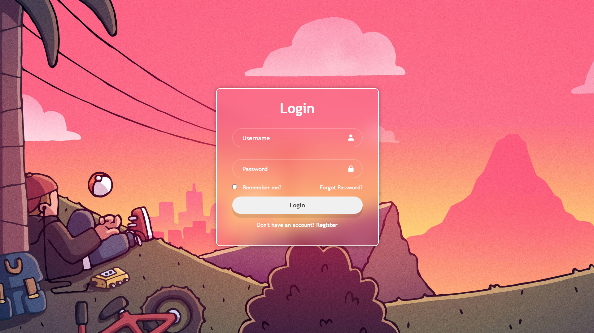

# Login Form Design

This is a simple HTML login form design with basic styling using CSS and icons from Boxicons.

## Demo
Check out the live demo: [loginForm](https://login-form-mykel.vercel.app/)

## Files

- **index.html:** Contains the HTML structure for the login form.
- **style.css:** Includes CSS styling for the login form.

## Preview

## How to Use

1. Download or clone the repository.
2. Open `index.html` in your web browser to view the login form.
3. Customize the form as needed by modifying the HTML and CSS files.

## Dependencies

- [Boxicons](https://boxicons.com/): Used for icons in the form.
